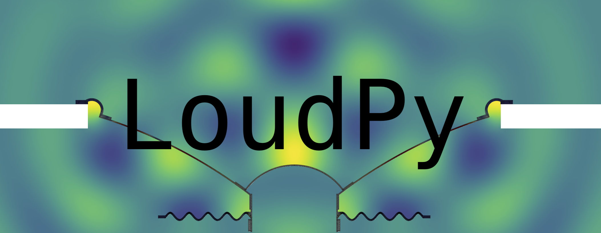

# LoudPy Beta

LoudPy is an open-source Python API dedicated to loudspeaker finite element simulation, released under the [GPL-3.0 license](https://www.gnu.org/licenses/gpl-3.0.html).

> ⚠️ **Beta version** — The API is still under active development. Proper documentation will be provided soon.
## Overview

Designing a loudspeaker with FEM means choosing between complex general-purpose tools that
require deep expertise, or expensive commercial software. LoudPy is a free, Python-based
alternative built specifically for loudspeaker/transducer engineers and researchers.

Starting from a CAD file of your loudspeaker, LoudPy lets you:
- run **harmonic frequency-domain simulations** (structural, acoustic, or fully coupled FSI)
- extract **eigenfrequencies** and mode shapes of the mechanical structure
- simulate **nonlinear behaviour** 
- post-process results directly as NumPy arrays and plot them

The finite element formulations are entirely custom — this project does not depend on any 
external FEM library. Numerical computations rely exclusively on **NumPy**, **SciPy**, and 
**Numba**, while meshing is handled by **Gmsh**.

This project was developed by Romain Degraeve as part of the
[IMDEA Master's programme in Acoustics](https://iags.univ-lemans.fr/en/education-programs/master-s-degrees-in-acoustics/parcours-en-anglais/imdea.html#Generalinformation1-1)
(International Master Degree in Acoustics).

## Installation

The easiest way to install LoudPy is via pip:

```bash
pip install loudpy
```

For development installation, see the [Developer Setup](#developer-setup) section below.

## Examples

The `LoudPy_exemples/` folder contains ready-to-run scripts:

| Example | Description |
|---|---|
| `Frequency_study/FSI` | Coupled structural–acoustic frequency sweep |
| `Frequency_study/Meca` | Mechanical-only frequency sweep |
| `Eigen_study` | Complex eigenfrequency analysis |
| `Time_study/Single_tone` | Nonlinear time-domain simulation, single tone |
| `Time_study/Multitone` | Nonlinear time-domain simulation, multi-tone |

## Publication

LoudPy will be presented at Acousticum 2026 — (ref. 226).

## Contributing

If you want to contribute to this open-source project, feel free to reach out:

- Email: [rom2graeve@gmail.com](mailto:rom2graeve@gmail.com)
- LinkedIn: [Romain Degraeve](https://www.linkedin.com/in/romain-degraeve-558073290/)

---

## Technical Details

### Workflow

LoudPy handles 2D axisymmetric geometries. The full pipeline is:

1. **Import** — a STEP file is loaded and converted to BREP format by LoudPy
2. **Physical entity assignment** — the [Gmsh standalone app](https://gmsh.info) is used to
   assign named physical groups: closed curve loops define subdomains, individual curves define
   boundaries. This produces two paired files: a `.brep` (geometry) and a `.geo` (named entities)
3. **Meshing** — LoudPy loads both files, links named entities to materials and boundary
   conditions, and generates the mesh via the Gmsh Python API (bundled — no separate install needed)
4. **Solve** — the chosen study assembles and solves the FEM system
5. **Export** — results are saved to **HDF5** (`.h5`) files; fields and coordinates are stored as
   NumPy arrays and reloaded with the built-in reader classes

### Solvers

| Study | Class | Description |
|---|---|---|
| Frequency-domain FSI | `FreqStudy` | Coupled structural–acoustic harmonic solver |
| Frequency-domain meca | `FreqStudy` | Mechanical-only harmonic solver |
| Complex eigenvalue | `EigenStudy` | Complex eigenfrequency analysis (mechanical domain) |
| Nonlinear time-domain | `TimeStudy` | Geometrically nonlinear transient solver |

### Physics

- **Structural domain** — 2D axisymmetric linear elasticity, T6 elements
- **Acoustic domain** — pressure-based formulation, T6 elements
- **Fluid-structure coupling** — `InterfaceAcouMeca` coupling assembled automatically
- **Damping** — Rayleigh (`α`, `β`) and hysteretic (`η`), both supporting non-proportional formulations
- **Radiation** — Perfectly Matched Layer (PML) for free-field acoustic radiation

### Material Library

Built-in materials (`materials.json`): `Polypropylene`, `Paper`, `Copper`, `Rubber`, `Kapton`,
`PhenolicCloth`, `Air`, `SolidGlue`. Custom materials can be added to the JSON file or defined
directly in the study script.

### Post-processing

- `FreqReader` / `EigenReader` / `TimeReader` — context-managed HDF5 readers
- `extract_subdomain(snap, name, field)` — field values restricted to a named subdomain
- `extract_interface(snap, name, field)` — field values along a coupling interface
- Built-in plotting: SPL sweeps, field maps, deformed interface, mechanical sweeps

---

## Developer Setup

LoudPy uses [PDM](https://pdm-project.org) for package management.

**Install PDM via pipx** (recommended — keeps PDM isolated):
```bash
pipx install pdm
```

**Or via uv:**
```bash
uv pip install pdm
```

**Verify:**
```bash
pdm --version
```

**Install LoudPy in editable mode:**
```bash
pdm install -e .
```

LoudPy is developed under Python 3.13. To install it with uv:
```bash
uv python install 3.13
```
